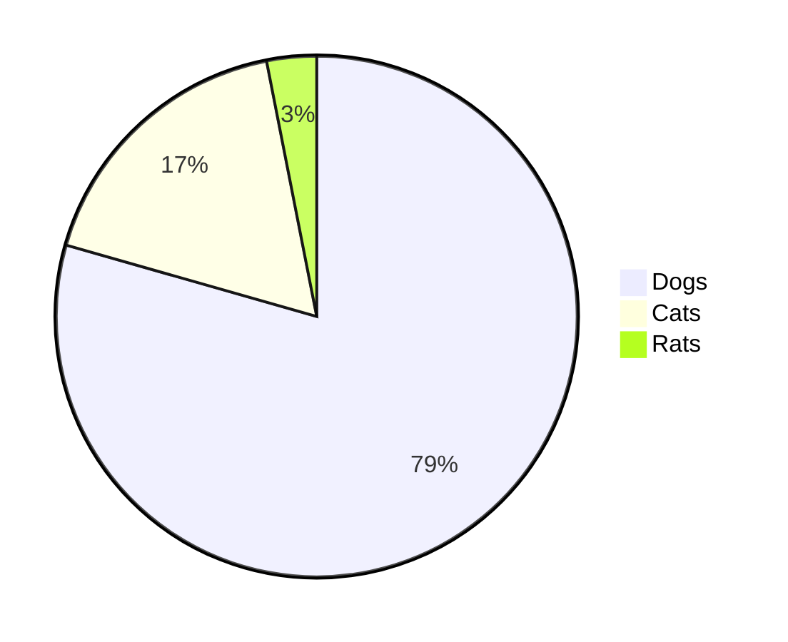

# Mermaid
> Last modified {docsify-updated}

### What?
mermaid is a Javascript based diagramming and charting tool.

### Why?
Generates diagrams flowcharts and more, using markdown-inspired text for ease and speed.

### Quick Links
- [Live Editor](https://mermaid-js.github.io/mermaid-live-editor/#/edit/eyJjb2RlIjoiZ3JhcGggVERcbkFbQ2hyaXN0bWFzXSAtLT58R2V0IG1vbmV5fCBCKEdvIHNob3BwaW5nKVxuQiAtLT4gQ3tMZXQgbWUgdGhpbmt9XG5DIC0tPnxPbmV8IERbTGFwdG9wXVxuQyAtLT58VHdvfCBFW2lQaG9uZV1cbkMgLS0-fFRocmVlfCBGW2ZhOmZhLWNhciBDYXJdXG4iLCJtZXJtYWlkIjp7InRoZW1lIjoiZGVmYXVsdCJ9fQ)
- [Examples](https://www.npmjs.com/package/mermaid)

### Examples
